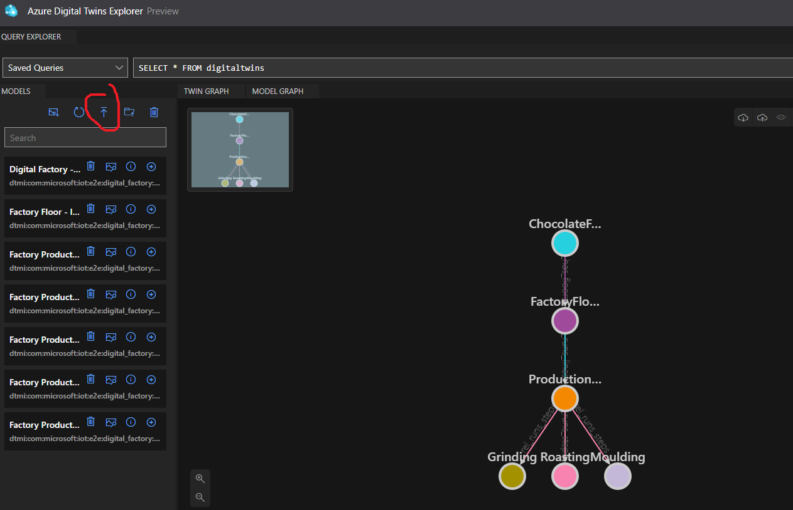
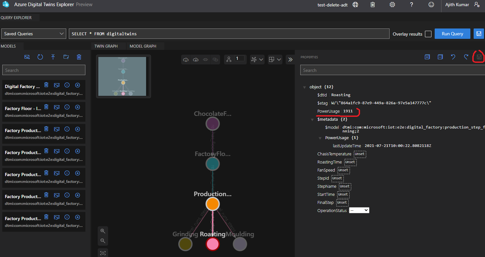
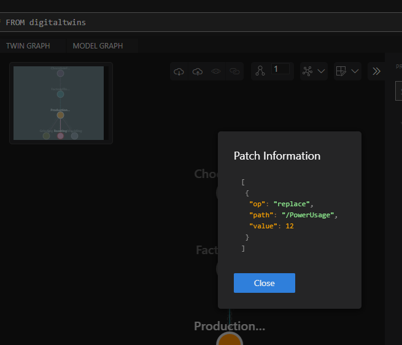

# digitaltwin-iot-opc
A repository with an end to end example, from demo opc server based on node-opcua to azure digital twin via Azure functions and Azure Iothub (resource required). 

Any comments, questions can be sent to : aji3003 at gmail

What is different from https://docs.microsoft.com/en-us/azure/digital-twins/tutorial-end-to-end?
*   The demo opc server here is based on https://github.com/node-opcua/node-opcua
    *   Which can be further customized for your own projects. Check the code for help.
*   Given the use of OPC technology enables users with the need to build a solution around it.
*   Allows the user to explore use of azure iotedge. 
*   Gives minimalistic code and scripts required.
*   Describes some manual connections, which possibly will imrpove understanding of resources and technology used.
*   Description of debugging issues in function.
*   For full deployment scripts and usage do refer to the original tutorial.

### edge-machine folder 
This folder has all the files that are to be put into the machine that acts as iotedge.
This is supposed to be targeted to Ubuntu 20.04. (no other machines have been tested)
    choco-demo-opc: A demo opc server based on node-opcua (https://github.com/node-opcua/node-opcua)
        custom: contains the choco_server.js file that actually contains the code for the demo opc server with all nodes.
    dockerfiles : 
        demo-opc-plc: Contains the docker file packing in of node-opcua to a docker image that is runnable given a javascript file.
    publisher : contains the pn.json or publishednodes.json file, which is used to connect to opc server and subscribe for necessary nodes.

#### pn.json file contents (no security)
The pn.json here is only subscribing to two nodes (can be extended), to have a publisher message below 0.5 KB which is the limit for free tier of iothub.
```
[
  {
    "EndpointUrl": "opc.tcp://127.0.0.1:12000/AzureVM/ChocolateFactoryServer",
    "UseSecurity": false,
    "OpcNodes": [
      {
        "Id": "ns=1;s=Roasting.RoastingTime",
        "OpcSamplingInterval": 60000,
        "OpcPublishingInterval": 30000,
        "HeartbeatInterval": 60000,
        "SkipFirst": true
      },
      {
        "Id": "ns=1;s=Roasting.PowerUsage",
        "OpcSamplingInterval": 60000,
        "OpcPublishingInterval": 30000,
        "HeartbeatInterval": 60000,
        "SkipFirst": true
      }
    ]
  }
]
```

This can be copied/deployed using ansible if preferrable.

### Edge installation
Just follow the iotedge (aziot-edge) installation manual
https://docs.microsoft.com/en-us/azure/iot-edge/how-to-install-iot-edge?view=iotedge-2020-11
Note: Edge installation and getting this right will require some prior ubuntu/linux knowledge, some docker knowledge. 
In addition to the mentioned packages also install docker-compose package to run the cholatefactory opc ua server demo file.

Tested with:
```
docker-compose -v : docker-compose version 1.25.0, build unknown
docker -v : Docker version 20.10.7+azure, build f0df35096d5f5e6b559b42c7fde6c65a2909f7c5
iotedge --version : iotedge 1.2.3 (aziot-edge)

$ docker images
REPOSITORY                                TAG             IMAGE ID       CREATED        SIZE
demo-opc-plc                              1.0.0           f4374cbe7454   20 hours ago   639MB
node                                      16-alpine3.12   f7cbc64ac763   6 days ago     112MB
mcr.microsoft.com/iotedge/opc-publisher   2.8             fa74e9aff78d   2 weeks ago    114MB
mcr.microsoft.com/azureiotedge-agent      1.2             4d911da05d94   2 weeks ago    167MB
mcr.microsoft.com/azureiotedge-hub        1.2             5a753c133e63   2 weeks ago    182MB
```

# Azure Cloud part

## createResources.ps1 powershell script.
Creates all resources required (Except connections), which includes Iothub, Azure Digital Twin,
Azure function. Check the script for further detailed information.
This does however lack: 
    *   Iothub system topic.
    *   Upload of azure function code and some configuration required.
        *   ADT_SERVICE_URL : "https://<twin-name>.api.weu.digitaltwins.azure.net
    *   EventGrid subscription towards system topic served by the function

After this the function should be ready to update the Azure Digital Twin.

## Azure Digital Twin
### models folder: 
Contains models from the Azure digital twin samples example. 
Disclaimer: This is taken from Azures standard example.
(https://github.com/azure-samples/digital-twins-samples/tree/master/)

This has to be uploaded into the digital twin resource

### Uploading models: 


To upload the models open the Azure Digital Twins Explorer, for this you have to have a role assignment of "Azure Digital Twins Owner", this is handled by the script, if it fails this has to be done manually.

Upload using the upload button marked in the image shown below in the Azure Digital Twins Explorer.


After this run the createModels.ps1 powershell script.

### createModels.ps1 powershell script.
This creates graph model using the models we uploaded previously. Also, relationships are added accordingly.
The final result (after reload and running the query) should look like the image above.

Note: Make sure both you and the azure function app has role based permission of "Azure Digital Twins Owner" for this above script to work. Azure function requires this permission to update the digital twin.

Note: Make sure you initialize the properties that is in the pn.json in this file above (edge-machine), so that the function can write to it.
This is a possible issue where it is not populated until initialized first time. Select the digital twin, update a property required like in the following example we update powerusage with a double/int value and click on save.



Expected update:



## Azure function
Check [azurefunction.md](https://github.com/ajithkumars/digitaltwin-iot-opc/blob/master/azurefunction.md).
Exists in the same folder.

## Iothub
Iothub requires some detailed configuration including configuring the test edge device and event subscription, this is discussed in a separte file for convenience. ([iothubReadme.md](https://github.com/ajithkumars/digitaltwin-iot-opc/blob/master/iothubReadme.md))
Exists in the same folder.