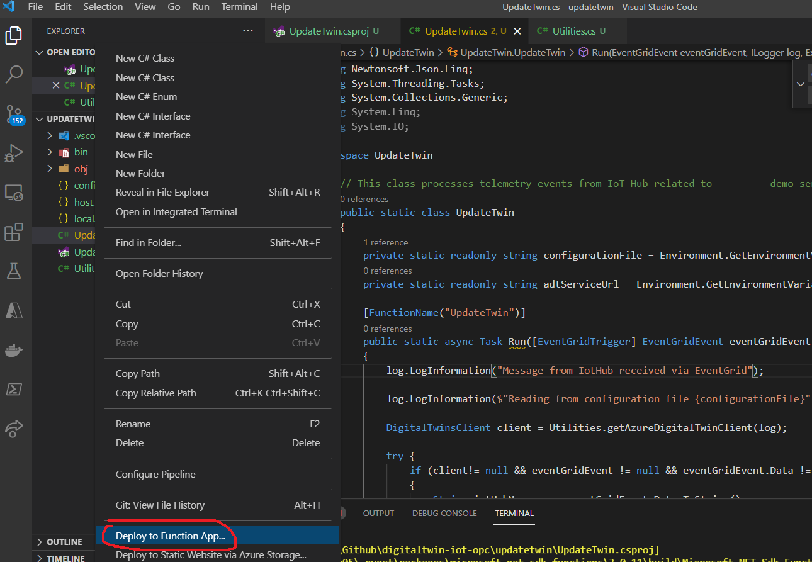
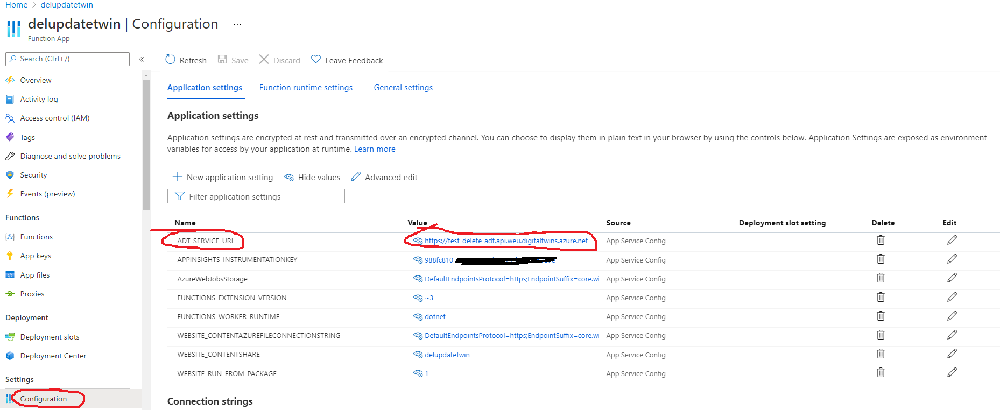
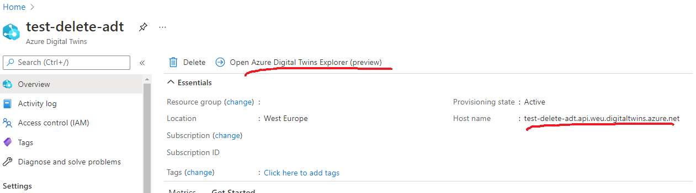
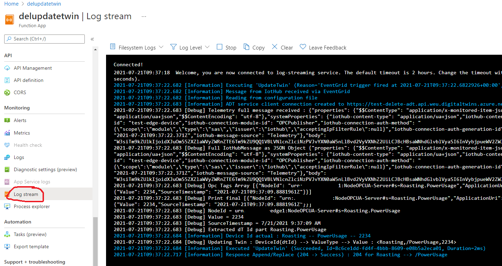
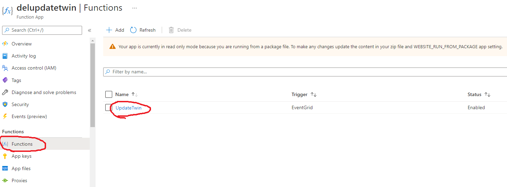
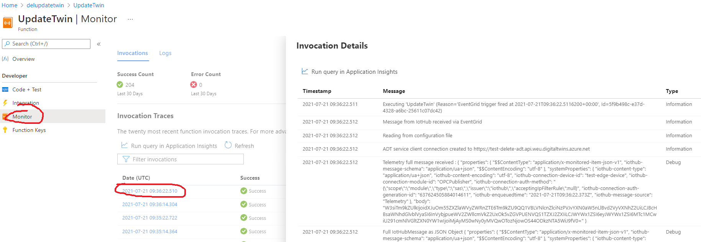
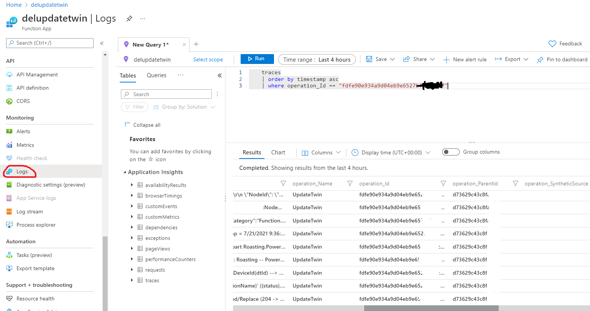

# Azure function 

## Configuring and executing
After the creation of function in createResources.ps1 script, two things have to be completed.

*  One to upload the function using Visual studio code. Right click on .vscode folder (which has to be generated, requires Azure functions extensions) and select "Deploy to function app". 
    * Other possible option via powershell: https://dzone.com/articles/how-to-deploy-azure-function-apps-with-powershell
   


-  To update configuration of the function with ADT_SERVICE_URL which mentions the https url to the digital twin.



The ADT_SERVICE_URL can be obtained from the portal from the digital twin resource.




## Debugging azure function

Debugging can be done in multiple ways: (These possibly require Application Insights)

* Logstream : from the Azure portal. 



* Logs per execution: Per execution logs (only recent) can be viwed at:





* Via Logs in portal: 



KQL query to get per execution logs (substitute proper operation_Id):
```
traces
	| order by timestamp asc
    | where operation_Id == "fdfe90e934a9d04eb9e6527b"
```