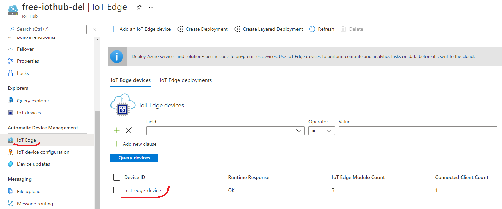
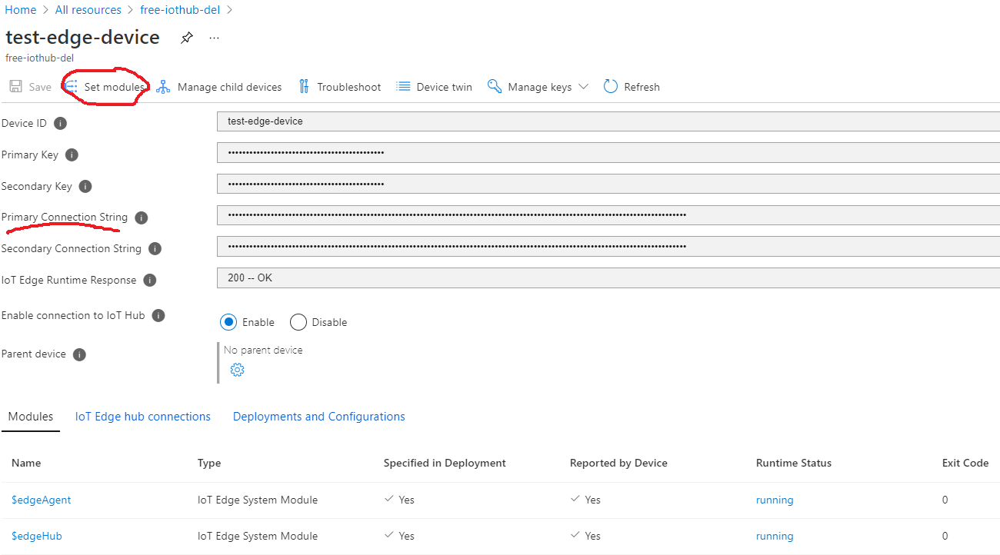
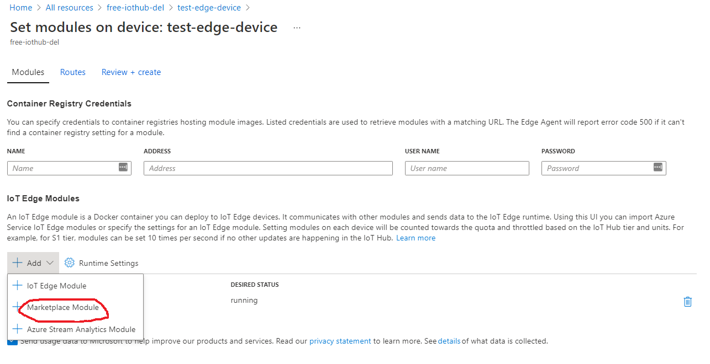
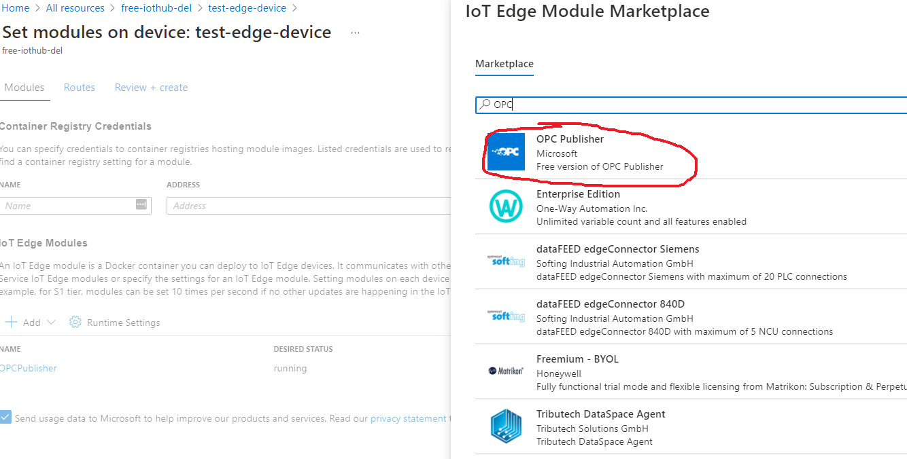
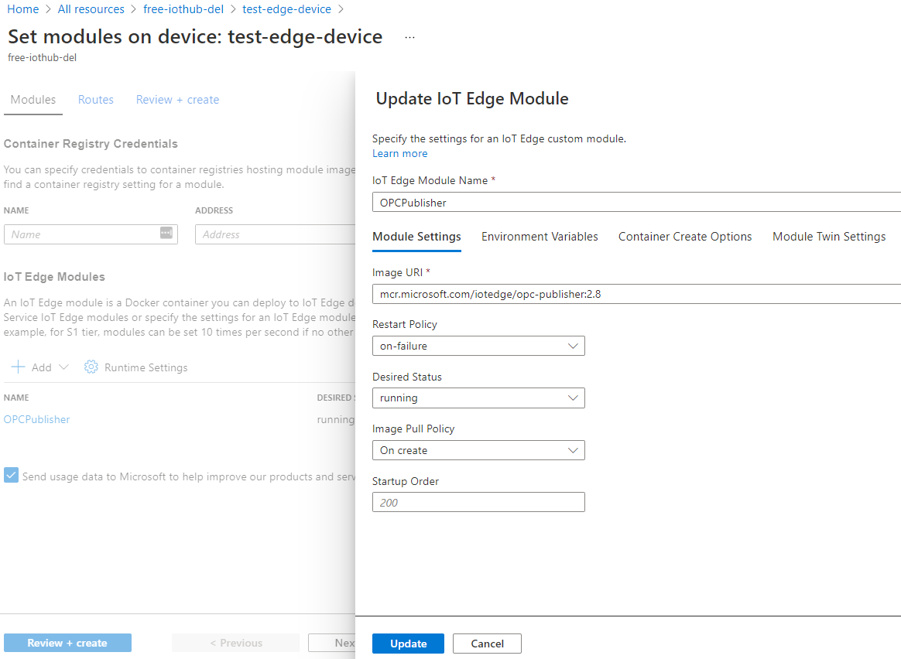
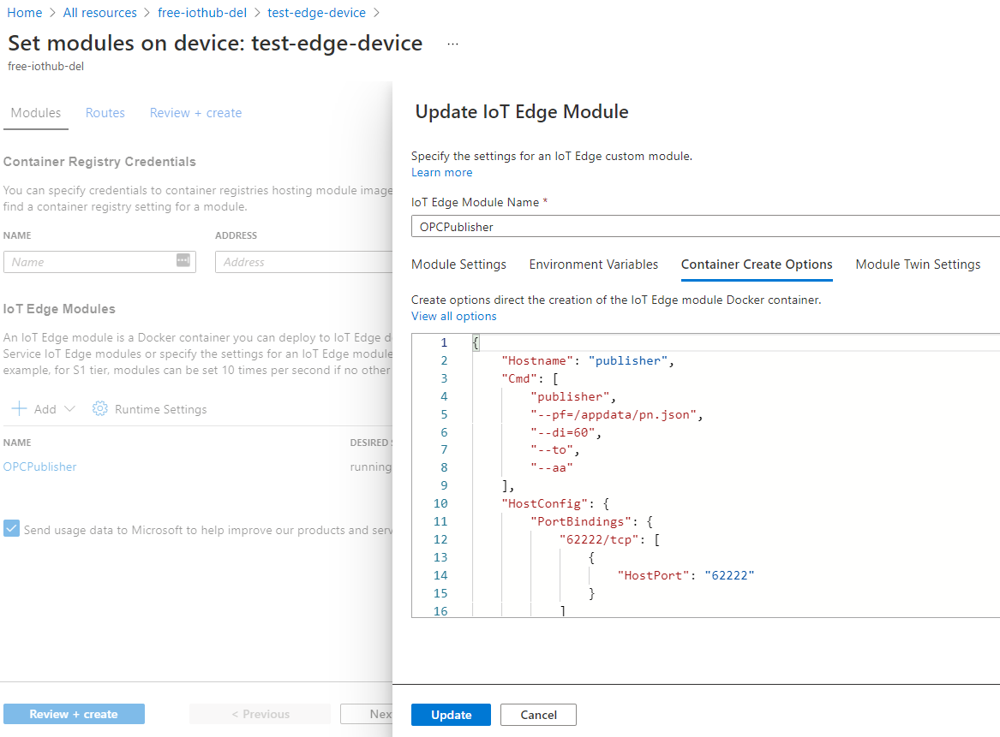
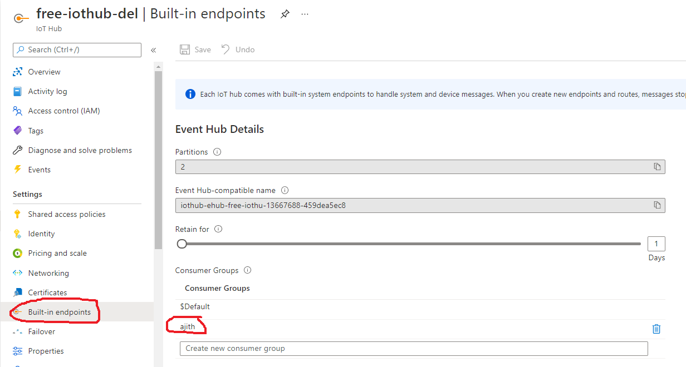
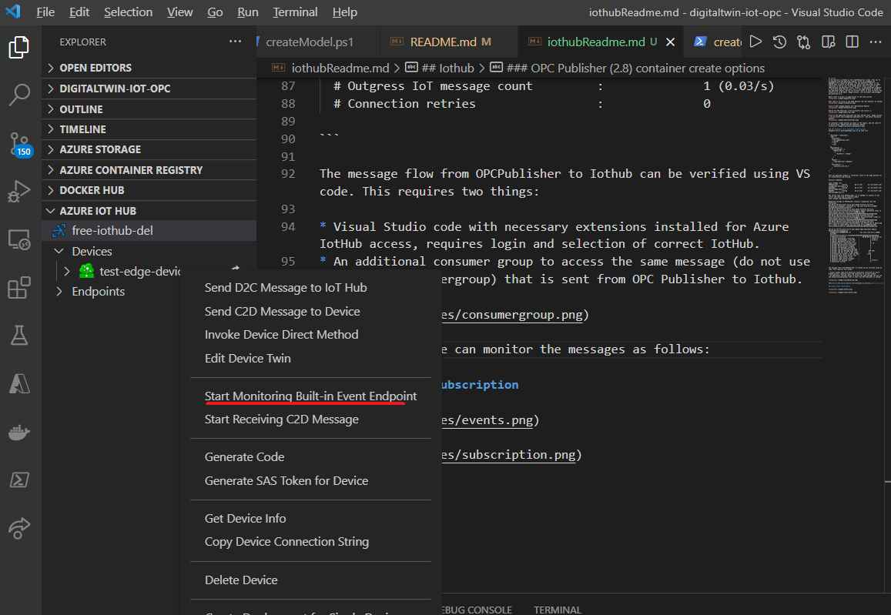
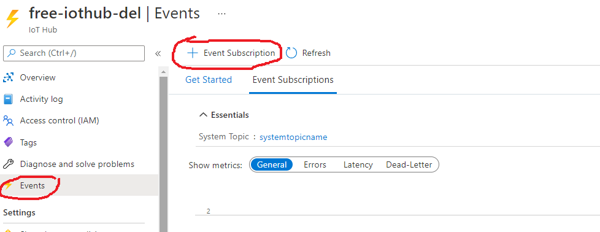
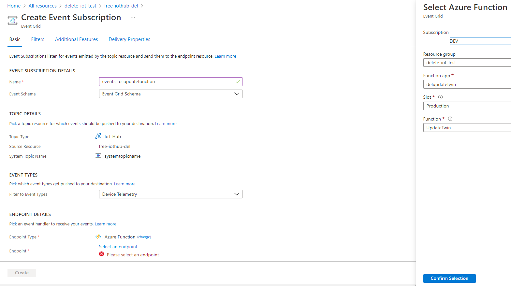

## Iothub
A test device is created in the createResources script. This has to be updated with OPC publisher module, since only edgeHub and edgeAgent are created by default. The opc publisher module is the module that connects to the demo opc server and subscribes to nodes specified in the pn.json file (shown below) which is part of the edge-machine configuration files. "Binds": ["/opt/publisher:/appdata" ], part here shows how pn.json file in the edge machine is bound to the publisher module. We use 2.8 version (which is also currently the latest as of 21.07.2021). Image version : mcr.microsoft.com/iotedge/opc-publisher:2.8 .

Below shown is access to edge device in the azure portal.


Next step is to click on the edge modules and "Set modules" as marked.


Click on Add iotedge modules and "Marketplace Module".


Search for OPC Publisher (from microsoft) and select it.


Click on the added OPC Publisher and edit options here. Image version : mcr.microsoft.com/iotedge/opc-publisher:2.8 . And select necessary options.


In container create options as shown in the figure, add the code for it given below. Update the OPC Publisher module.


### OPC Publisher (2.8) container create options 
Standard with a publishednodes.json or pn.json file
```
{
  "Hostname": "publisher",
  "Cmd": [
    "publisher",
    "--pf=/appdata/pn.json",
    "--di=60",
    "--to",
    "--aa"
  ],
  "HostConfig": {
    "PortBindings": {
      "62222/tcp": [
        {
          "HostPort": "62222"
        }
      ]
    },
    "Binds": [
      "/opt/publisher:/appdata"
    ],
    "ExtraHosts": [
      "localhost:127.0.0.1"
    ]
  }
}
```

Once opc publisher module is installed, check in the edge machine for its installation and working. 

Ncessary commands: 
```
sudo iotedge list
OPCPublisher     running          Up an hour       mcr.microsoft.com/iotedge/opc-publisher:2.8
edgeAgent        running          Up an hour       mcr.microsoft.com/azureiotedge-agent:1.1
edgeHub          running          Up an hour       mcr.microsoft.com/azureiotedge-hub:1.1

#To follow logs from OPCPublisher (if it manages to connect to opc server and subscribe to expected nodes)
sudo iotedge logs OPCPublisher -f

#Expected message as OPCPubisher connects (something like the following): 
[07:50:22 INF Microsoft.Azure.IIoT.OpcUa.Protocol.Services.DefaultSessionManager] Connected to 'opc.tcp://127.0.0.1:12000/AzureVM/ChocolateFactoryServer' 
[07:50:22 INF Microsoft.Azure.IIoT.OpcUa.Protocol.Services.SubscriptionServices+SubscriptionWrapper] Added 2 monitored items to subscription opc.tcp://127.0.0.1:12000/AzureVM/ChocolateFactoryServer_2d58a568e976a19059233ea09a5da73d48bace9d 
[07:50:22 INF Microsoft.Azure.IIoT.OpcUa.Protocol.Services.SubscriptionServices+SubscriptionWrapper] Now monitoring 2 nodes in subscription opc.tcp://127.0.0.1:12000/AzureVM/ChocolateFactoryServer_2d58a568e976a19059233ea09a5da73d48bace9d 
[07:50:22 INF Microsoft.Azure.IIoT.OpcUa.Protocol.Services.SubscriptionServices+SubscriptionWrapper] Set Monitoring to Reporting for 2 nodes in subscription opc.tcp://127.0.0.1:12000/AzureVM/ChocolateFactoryServer_2d58a568e976a19059233ea09a5da73d48bace9d 

[07:51:21 INF Microsoft.Azure.IIoT.OpcUa.Edge.Publisher.Engine.DataFlowProcessingEngine] 
  DIAGNOSTICS INFORMATION for          : opc.tcp://127.0.0.1:12000/AzureVM/ChocolateFactoryServer_51e3e35d33702b3f601700d2852c82c5b2336b3e
  # Ingestion duration                 :    00:00:00:29 (dd:hh:mm:ss)
  # Ingress DataChanges (from OPC)     :              1 (0.03/s)
  # Ingress ValueChanges (from OPC)    :              2 (0.07/s)
  # Ingress BatchBlock buffer size     :              0
  # Encoding Block input/output size   :              0 | 0
  # Encoder Notifications processed    :              2
  # Encoder Notifications dropped      :              0
  # Encoder IoT Messages processed     :              1
  # Encoder avg Notifications/Message  :              2
  # Encoder avg IoT Message body size  :            394 (0%)
  # Encoder avg IoT Chunk (4 KB) usage :            0.1
  # Estimated IoT Chunks (4 KB) per day:          2,953
  # Outgress Batch Block buffer size   :              0
  # Outgress input buffer count        :              0
  # Outgress input buffer dropped      :              0
  # Outgress IoT message count         :              1 (0.03/s)
  # Connection retries                 :              0

```

The message flow from OPCPublisher to Iothub can be verified using VS code. This requires two things:

* Visual Studio code with necessary extensions installed for Azure IotHub access, requires login and selection of correct IotHub.
* An additional consumer group to access the same message (do not use the defaultconsumergroup) that is sent from OPC Publisher to Iothub.



Start monitoring for the test-edge device as follows:


Expected output in VS code:

```
[
  {
    "NodeId": "urn:nyeveieredge1:NodeOPCUA-Server#s=Roasting.PowerUsage",
    "ApplicationUri": "urn:nyeveieredge1:NodeOPCUA-Server",
    "Value": {
      "Value": 2149,
      "SourceTimestamp": "2021-07-21T08:22:09.845272Z"
    }
  }
]
```

## Create event subscription
Once we have verified data flow from edge-machine to iothub, next step is to connect these events to "updatetwin" function which can update the digital twin based on this input. Event subscription in Iothub is created in the Azure portal as shown below.



Next, create event subscription from the system topic towards the Azure function "updatetwin", and we select Device Telemetry as the filtered message type.


